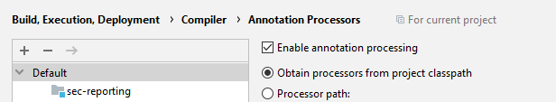
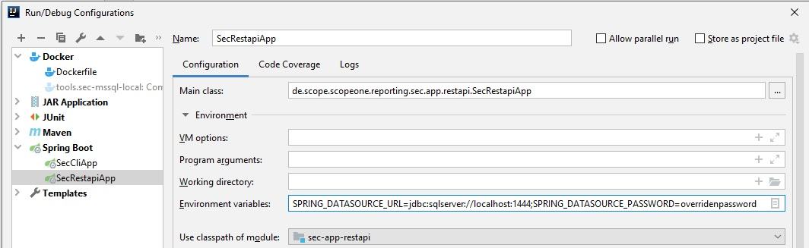
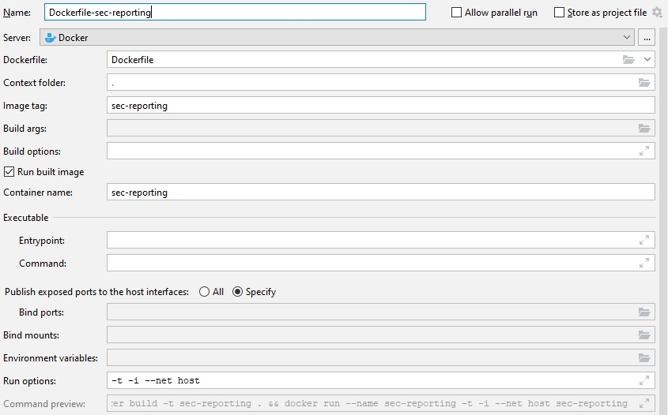

# Running SEC Reporting Service locally
SEC reporting service is dependent on other external services (like database, SMTP server, ...). This guide shows you, how to run all those services locally to be able to run the service outside Scope intranet or completelly offline.

## Building locally

>  
> * Prerequisity 1: Maven 3 with JDK 11
> * Prerequisity 2: You need running Docker container on your machine to be able to build project with JunitTests. Because most of them use dockerized ["Testcontainers"](https://www.testcontainers.org/) framework, which can provide us dockerized external services (like database or any other needed)

* Open your terminal in project's root folder and run ```mvn clean package```

## Running Spring Boot REST applicatoin locally

>  
>* Prerequisity 1: tested with JDK 11
>* Prerequisity 2: In this guide, we are using dockerized external services (like database) needed for the application run. Therefore you need running Docker container on your machine. Alternatively you can install external services on your machine without dockerization, but this way is not covered here.
>* Prerequisity 3: Your need to enable Annotation Processing, if you want to build and run from your IDE. This is needed for processing of Lombok annotations 
>
>

* run external services locally (databases, redis cache, ...)
open your terminal and to go folder ```./doc/tools```. From here run ```docker-compose up```. This should start all the external services needed to run your application locally. Connection of your application to the services should work out of the box, because we try to keep the settings (ports, credentials, ...) in [application.properties](../../resources/main/application.properties) corresponding to the settings in the [docker-compose.yml](../scripts/docker-compose.yml)

* next thing to do is to import DB schema into your dockerized mssql server. First connect with any tool to the database.
 ```jdbc:sqlserver://localhost:1433;user=sa;password=local-scoperepository-db-password-123```

   Then, too create database schema for SEC Reportign DB objects, run the script [scope-sec-db-schema.sql](../../resources/test/scope-sec-db-schema.sql)

* to import some sample Scope data for testing purposes, you can run the script [scope-sec-db-sample-data.sql](../../resources/test/scope-sec-db-sample-data.sql)

* run the application from your IDE. The configuration in [application.yml](../../sec-app-restapi/src/main/resources/application.yml) correspond to DB settings in [docker-compose.yml](../scripts/docker-compose.yml) and thus everything should work out of the box. Nevertheless, if you want to connect to external services or if you changed port or credentials to your local DB, you can always override application.yaml settings by environment variables in Intellij "Run configuration" 

    

* alternatively you can run the SEC reporting service as dockerized container. 
    * open terminal and go to project root folder
    * build the project and generate executable JAR by running ```mvn clean package``` 
    * run docker container by command  
    ```docker build -t sec-reporting-service . && docker run -p 127.0.0.1:1433:1433 --name sec-reporting-service -t -i --net host sec-reporting-service```
    * alternatively you can configure your Dockerfile run environments in Intellij
    
    
    

