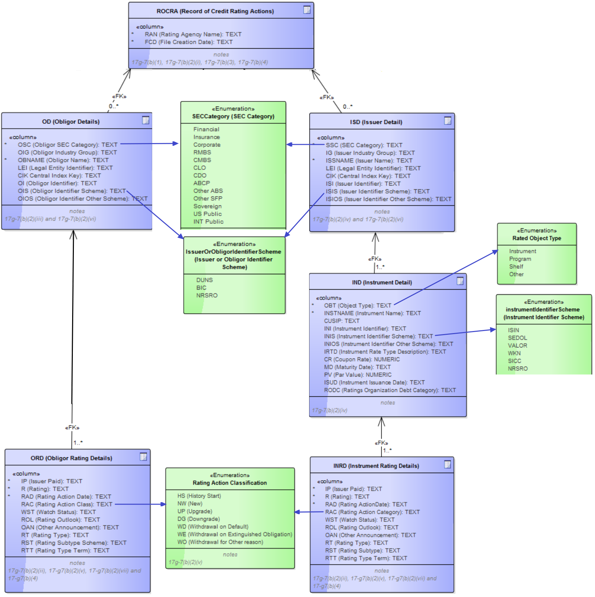

# XBRL reports and XSD schema
// TO_DO provide connection and description
* [XBRL "Rating history publication guide"](https://confluence.scopegroup.com/display/SCOP/Project+documents+and+resources?preview=/58854536/58854522/Rating%20History%20Files%20Publication%20Guide.pdf)
* [XBRL entities with field descriptiono and constraints in tabellar way](https://confluence.scopegroup.com/display/SCOP/XBRL+list+of+fields)
* XBRL entities in graphical way (in picture bellow)

